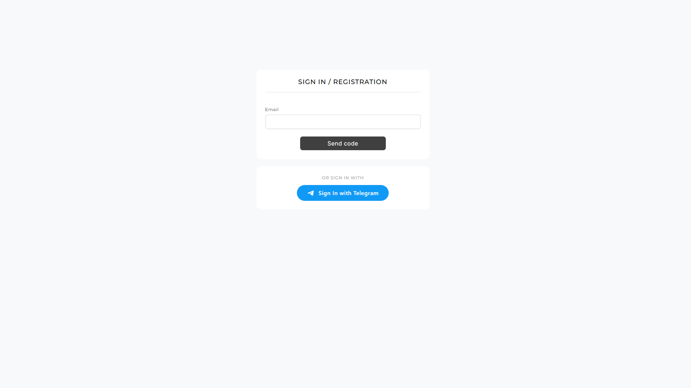
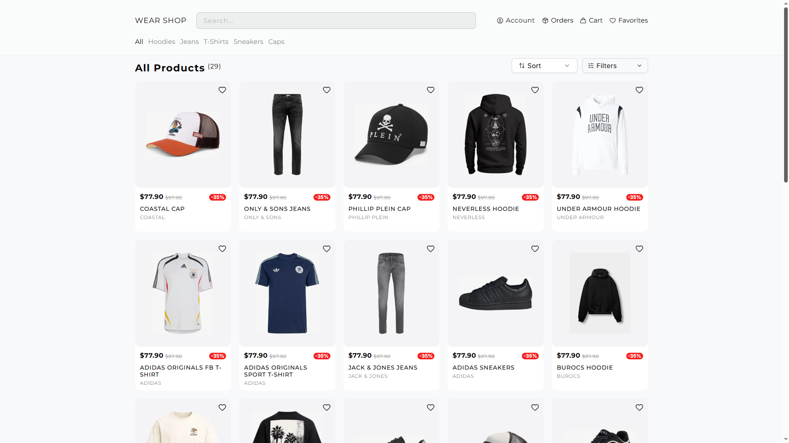
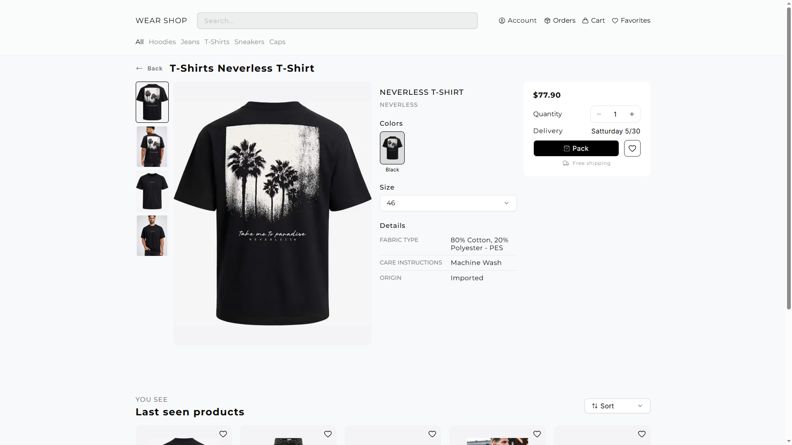
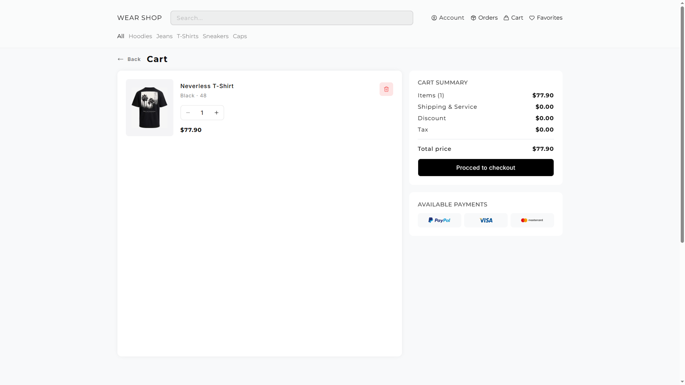
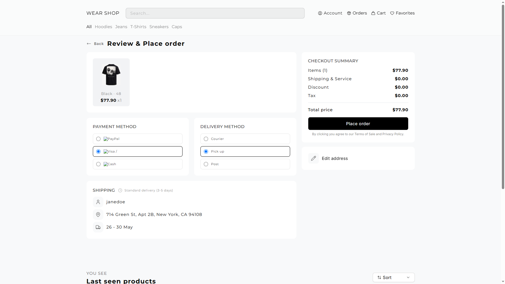
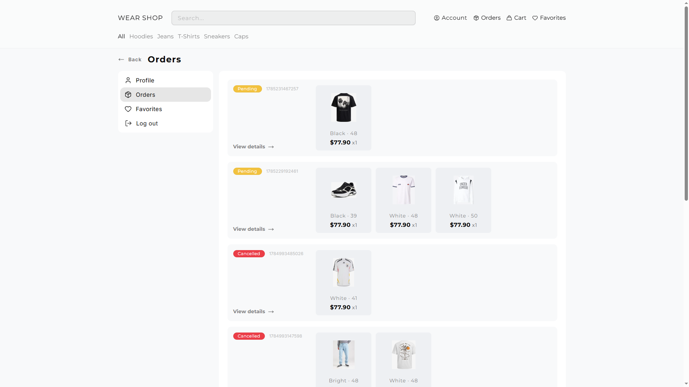
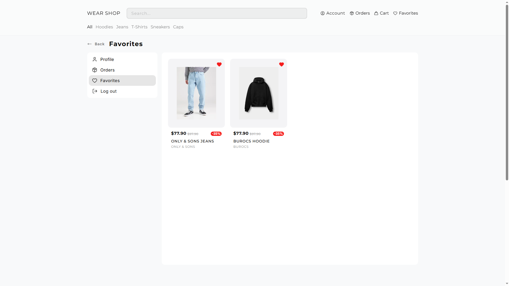
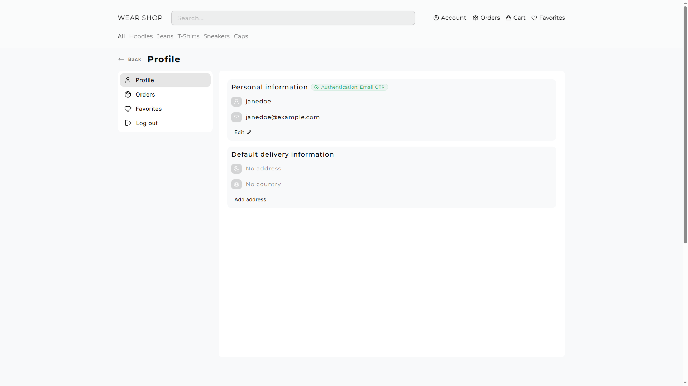

Проект разработан полностью самостоятельно в качестве pet-project. Основная цель - построить максимально приближенный к коммерческой разработке интернет-магазин с совеременной архитектурой, использованием Server Components, React Query, Prisma, Next.js App Router.

# E-Commerce MVP

Полноценный интернет-магазин, разработанный на **Next.js 15 (AppRouter)**, **React**, **Typescript**, **Prisma**, **PostgreSQL**, **ReactQuery** и **NextAuth**

## Основной функционал

### Авторизация:
    - OTP авторизация по Email
    - Автоматическая регистрация нового пользователя

### Каталог товаров
    - Поиск товаров
    - Категории
    - Быстрый просмотр товара
    - Выбор варианта товара
    - Добавление в корзину
    - Добавление в избранное

### Страница товара
    - Галерея изображений
    - Выбор цвета
    - Выбор размера
    - Выбор количества
    - Добавление в корзину
    - Добавление в избранное
    - Последние просмотренные товары

### Корзина
    - Добавление товара
    - Изменение количества
    - Удаление товаров
    - Автоматический пересчёт стоимости
    - Итоговая стоимость заказа
    - Переход к оформлению

### Оформление заказа
    - Просмотр состава заказа
    - Выбор способа оплаты
    - ВЫбор способа доставки
    - Редактирование адреса доставки
    - Оплата заказа

### Заказы
    - История заказов
    - Детальная информация
    - Статус заказа
    - Просмотр товаров
    - Отмена заказа (до обработки)
    - Изменение адреса (до обработки)

### Избранное
    - Добавление товара
    - Удаление товара
    - Список всех избранных товаров

### Профиль
    - Редактирование персональной информации
    - Базовый адрес доставки

## Дополнительные возможности
    - Последние просмотренные товары
    - Полностью адаптивный интерфейс
    - Skeleton загрузка
    - Оптимистичные обновления (Optimistic UI)
    - React Query кеширование
    - Server components + Client components
    - Server actions
    - Поддержка гостевого режима с переносом данных после авторизации

## Используемые технолгии
    - Next.js (App Router)
    - React
    - Typescript
    - Prisma ORM
    - RostgreSQL
    - React Query
    - NextAuth
    - Zustand
    - Tailwind v4
    - Shadcn UI

## Архитектурные особенности

Во время разработки особое внимание уделялось:
    - разделению сервеной и клиентской логики;
    - артихектуре приложения;
    - производительности;
    - оптимизации запросов;
    - кешированию данных;
    - UX и плавности интерфейса.

## Демо

Vercel:
https://www.code8d.ru/

> Для просмотра из РФ может потробоваться VPN.